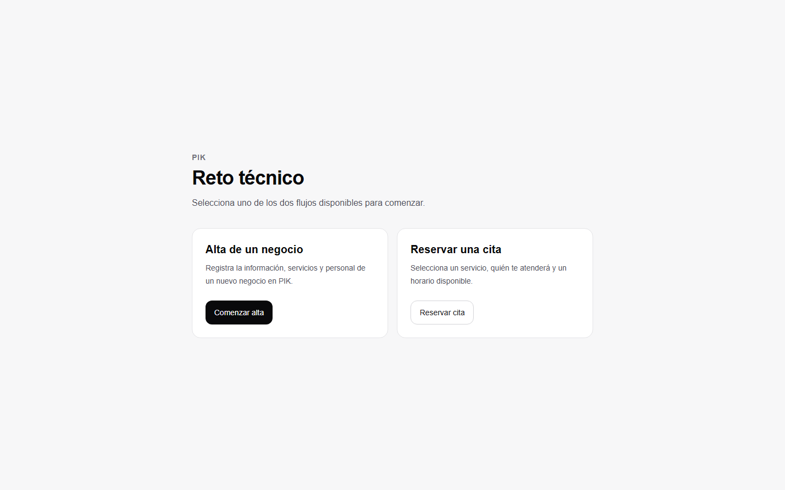

# PIK - Reto técnico

Aplicación web construida con Next.js para demostrar dos recorridos completos de un marketplace de belleza y bienestar:

- alta de un negocio;
- reservación de una cita.

Todo funciona con datos locales y estado en memoria. No requiere base de datos, autenticación, pagos ni otros servicios externos.

## Demo

[Ver la aplicación en funcionamiento](https://pik-reto-tecnico.vercel.app)



## Requisitos

- Node.js 20.9 o superior
- npm

## Cómo correr el proyecto

1. Clona el repositorio y entra a la carpeta del proyecto.
2. Instala las dependencias:

```bash
npm install
```

3. Inicia el servidor de desarrollo:

```bash
npm run dev
```

En PowerShell puedes usar `npm.cmd run dev` si la política de ejecución bloquea `npm`.

4. Abre [http://localhost:3000](http://localhost:3000).

Para comprobar la versión de producción:

```bash
npm run lint
npm run build
npm start
```

## Rutas principales

- `/`: acceso a los dos recorridos.
- `/alta-negocio`: wizard de alta de negocio.
- `/negocio/studio-nova`: perfil de ejemplo y reservación de cita.

## Funcionalidades

### Alta de negocio

El alta conserva toda la información en un estado general mientras se avanza o se regresa entre cinco pasos:

1. datos del negocio: nombre, categoría y teléfono;
2. ubicación y horarios semanales;
3. servicios: alta, edición y eliminación con nombre, duración y precio;
4. personal: alta, edición y eliminación con asignación de servicios;
5. resumen de la información y confirmación.

Los formularios validan los campos obligatorios y evitan avanzar cuando falta información. Los servicios y el personal incluyen estados vacíos, y la confirmación muestra un estado de éxito.

### Reservación de cita

La reservación utiliza un negocio simulado y recorre cinco pasos:

1. perfil del negocio y catálogo de servicios;
2. selección de servicio;
3. selección de una persona que puede realizar ese servicio;
4. selección de fecha y hora, con horarios ocupados deshabilitados;
5. resumen y confirmación de la cita.

Las selecciones se conservan al regresar. Si se cambia el servicio o el profesional, se limpian las elecciones dependientes para evitar combinaciones inválidas.

## Organización del proyecto

```text
src/
|-- app/
|   |-- alta-negocio/
|   |-- negocio/studio-nova/
|   |-- globals.css
|   |-- layout.tsx
|   `-- page.tsx
|-- funcionalidades/
|   |-- alta-negocio/
|   |   |-- components/
|   |   |-- config.ts
|   |   |-- identificadores.ts
|   |   |-- types.ts
|   |   `-- validators.ts
|   `-- reservacion/
|       |-- components/
|       |-- config.ts
|       |-- mocks.ts
|       `-- types.ts
`-- shared/
    |-- components/
    `-- hooks/
```

Las rutas viven en `src/app` y se mantienen como Server Components sencillos. La lógica específica se agrupa por dominio en `src/funcionalidades`, lo que evita mezclar el alta con la reservación. Solo los componentes que necesitan estado, eventos o formularios usan Client Components.

Los tipos compartidos de cada recorrido están separados de la interfaz. Cada `config.ts` concentra los pasos y el estado inicial de su recorrido; las validaciones del alta viven en un archivo propio y los datos simulados del negocio reservable se concentran en `mocks.ts`. Las piezas visuales y de accesibilidad reutilizadas por ambos recorridos viven en `src/shared`.

## Decisiones principales de UI/UX

- enfoque mobile-first, con contenido en una sola columna y botones táctiles de al menos 44 píxeles;
- indicador de paso y barra de progreso para comunicar ubicación y avance;
- acciones principales de ancho completo en celular y distribución horizontal en pantallas mayores;
- validaciones junto al campo correspondiente y mensajes generales cuando falta una selección;
- estados seleccionados visibles, horarios ocupados deshabilitados y etiquetas accesibles;
- botones para regresar sin perder la información ya capturada;
- estados vacíos para servicios y personal, y mensajes claros al confirmar cada recorrido.

La aplicación no simula esperas porque todos los datos son locales y síncronos. Un estado de carga cobraría sentido al sustituir los mocks por una API.

## Cómo comprobar cada paso

### Alta de negocio

1. En datos del negocio, intenta continuar con campos vacíos; después captura un nombre, una categoría y un teléfono de 10 dígitos.
2. En ubicación y horarios, comprueba campos obligatorios, código postal de 5 dígitos, al menos un día abierto y cierre posterior a la apertura.
3. En servicios, verifica el estado vacío, las validaciones de nombre, duración y precio mayores que cero, y las acciones de agregar, editar y eliminar. No debe avanzar sin al menos un servicio.
4. En personal, agrega una persona y asígnale uno o más servicios; verifica también editar, eliminar y la validación que impide avanzar sin personal.
5. En el resumen, revisa todos los datos, regresa a pasos anteriores para confirmar que se conservaron y finaliza hasta ver `Negocio registrado`.

### Reservación de cita

1. En el perfil, revisa la información del negocio y su lista de servicios.
2. Intenta continuar sin servicio y luego selecciona uno.
3. Comprueba que solo aparezca personal compatible e intenta continuar sin seleccionar a nadie.
4. Selecciona una fecha; confirma que los horarios ocupados estén deshabilitados y que no sea posible continuar sin una hora disponible.
5. Revisa el resumen, regresa para comprobar que la selección se conserva y confirma hasta ver `Cita confirmada`.

También conviene repetir ambos recorridos con el modo de dispositivo móvil del navegador.

## Uso de inteligencia artificial

Se utilizó IA como apoyo durante el desarrollo para:

- revisar la arquitectura existente antes de modificarla;
- proponer una separación sencilla de componentes, tipos, validaciones y mocks;
- apoyar la implementación de los recorridos;
- detectar y corregir problemas encontrados durante las pruebas manuales;
- revisar lint, TypeScript, build y documentación.

Las decisiones se adaptaron al código del proyecto y cada cambio se revisó manualmente. La solución se mantuvo deliberadamente sencilla para poder explicar y defender su funcionamiento.

## Qué agregaría en una segunda versión

- persistencia mediante una API y una base de datos;
- autenticación y roles para negocios, personal y clientes;
- disponibilidad calculada con duración del servicio, horario real y zona horaria;
- estados de carga y recuperación ante errores de red;
- pruebas unitarias, de componentes y de recorridos completos;
- mejoras adicionales de accesibilidad y navegación por teclado;
- confirmaciones por correo o mensajería y pagos reales;
- imágenes, reseñas y administración del perfil del negocio.

## Stack

- Next.js 16 con App Router
- React 19
- TypeScript
- Tailwind CSS 4
- ESLint
